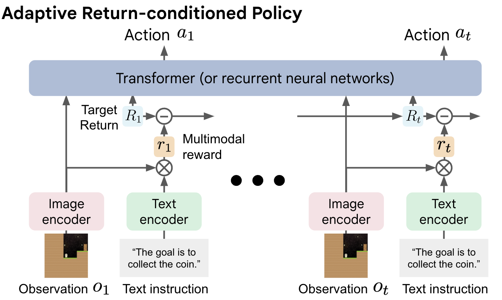

# ARP-DT

Official Jax/Flax implementation of ARP-DT.

**[Guide Your Agent with Adaptive Multimodal Rewards](https://arxiv.org/abs/2309.10790) (Accepted to NeurIPS 2023)**\
[Changyeon Kim](https://changyeon.page)<sup>1</sup>, [Younggyo Seo](https://younggyo.me)<sup>2</sup>, [Hao Liu](https://haoliu.site)<sup>3</sup>, [Lisa Lee](https://leelisa.com)<sup>4</sup>\
[Jinwoo Shin](https://alinlab.kaist.ac.kr/shin.html)<sup>1</sup>, [Honglak Lee](https://web.eecs.umich.edu/~honglak/)<sup>5,6</sup>, [Kimin Lee](https://sites.google.com/view/kiminlee)<sup>1</sup>

<sup>1</sup>KAIST <sup>2</sup>Dyson Robot Learning Lab <sup>3</sup>UC Berkeley\
 <sup>4</sup>Google DeepMind <sup>5</sup>University of Michigan <sup>6</sup>LG AI Research



This implementation has been tested on Nvidia GPUs.

The code supports the following methods and baselines:
- *Instruct*RL: Training transformer policy with pretrained multimodal MAE encoding w/ and w/o instructions.
- ARP-DT: Training transformer policy conditioned on multimodal rewards from pre-trained CLIP and pretrained multimodal MAE encoding.
- ARP-DT+: Training transformer policy conditioned on multimodal rewards from fine-tuned CLIP and pretrained multimodal MAE encoding.

## Installation
Install the dependencies with pip.
```
conda create -n arp python=3.8
conda activate arp
cat requirements.txt | xargs -n 1 -L 1 pip install
```

## Supported Environments
We support following environments with various types.
| Env name | Env type                                                                 |
|----------|--------------------------------------------------------------------------|
| CoinRun  | none, aisc, aisc_gem                                                     |
| Maze     | none, aisc, yellowline, redline_yellowgem, reddiag_redstraight_yellowgem |

For experiments in our paper, we use the following environments.
| Task            | Train (env_name/env_type)         | Test (env_name/env_type)                      |
|-----------------|--------------------------|--------------------------------------|
| CoinRun         | coinrun / none           | coinrun / aisc                       |
| CoinRun-bluegem | coinrun / none           | coinrun / aisc_gem                   |
| Maze I          | maze / aisc              | maze / none                          |
| Maze II         | maze / yellowline        | maze / redline                       |
| Maze III        | maze / redline_yellowgem | maze / reddiag_redstraight_yellowgem |

## Usage
### 1. Download Expert Demonstrations
We provide expert datasets used for training in our Procgen experiments.

| Task                       | Link (Google Drive)              |
|----------------------------|----------------------------------|
| CoinRun \| CoinRun-bluegem | [Link](https://drive.google.com/drive/folders/17Sv0NHASzJEiam0b-lfg2gZ62SoRqbMX?usp=drive_link) |
| Maze I                     | [Link](https://drive.google.com/drive/folders/1XMB0JAQTrhqFNTDy-dCii4ymQTYk7yME?usp=drive_link) |
| Maze II \| Maze III        | [Link](https://drive.google.com/drive/folders/18QllsVBrHiEBCHA_IhTAFniFwVbOewDD?usp=drive_link)|
#### 1-1. Collecting Demonstrations with High resolution (256 x 256)
For those interested in constructing their own dataset, we provide trained PPG checkpoints in `./data/checkpoints`. 
You have to collect following demonstrations.
1. Training demonstartions. (data_type: train)
2. Validation demonstrations. (data_type: val)
3. (Optional) Test demonstartions (data_type: test, only for comparing with goal-conditioned baselines.)

Collecting demonstrations via following commands:
```python
cd ./data/PPG
python -m collect_procgen_data --model_dir {path of saved model file} --num_demonstrations {number of demonstrations} --env_name {procgen env name} --env_type {env_type} --data_type {train/eval/test} --num_levels {number of levels} --start_level {level to start} --output_dir {path of saved demonstrations}

# Example in CoinRun environments.
CUDA_VISIBLE_DEVICES=0 python -m collect_procgen_data --model_dir ./checkpoints/coinrun_hard_level500/model1000_IC100007936.jd --num_demonstrations 100 --env_name coinrun --env_type none --data_type train --num_levels 500 --start_level 0 --distribution_mode hard --output_dir ./data/coinrun
```

### 2. Labeling Multimodal Rewards
Next, you have to label demonstrations with multimodal rewards via following commands:
```python
python -m arp_dt.label_reward --env_name {env_name} --env_type {env_type} --data_dir {data hdf5 file path} --model_type {clip/clip_ft} --model_ckpt_dir {checkpoint path of fine-tuned CLIP.}

# Example in CoinRun experiments for training demonstrations.
CUDA_VISIBLE_DEVICES=0 python -m arp_dt.label_reward --env_name coinrun --env_type none --data_dir ./data/coinrun/coinrun_hard_level0to500_num500_frame4/data_train.hdf5 --model_type clip_ft --model_ckpt_dir ./data/coinrun/coinrun_hard_level0to500_num500_frame4/clip_ft_checkpoints/best_checkpoint.pt
```

### 3. Fine-tuning CLIP
You can fine-tune CLIP using expert demonstrations from training environments via following commands:
```python
python3 -m finetune_module.finetune --data.path {training data path} --output_dir {directory for saving checkpoints} --env_name {env_name}  --data.train_env_type {env_type} --data.num_demonstrations {number of training demonstrations} --lambda_id {scaling hyperparameter for inverse dynamics loss}

# Example in CoinRun experiments.
CUDA_VISIBLE_DEVICES=0 python3 -m finetune_module.finetune --data.path ./data/maze --default_root_dir ./debug --epochs 20 --model_type clip_multiscale_ensemble --game_name maze --data.train_env_type aisc --data.image_key "ob" --data.num_demonstrations 500 --lambda_id 1.5
```

### 4. Training Agents
Experiments can be launched via the following commands.\
For training *Instruct*RL|GC-*Instruct*RL agents, set {use VL model} as False.\
If you want to train/evaluate agents with goal images, you have to collect demonstrations for test (Please refer to 1.3.)
```python
sh ./jobs/train_procgen.sh {data_dir} {env_name} {env_type of training environemts} {env_type of evaluation environments} {augmentation} {use VL model: True | False} {VL model_type: BC | clip | clip_ft | clip_goal_conditioned | GCBC} {VL model checkpoint path (only for ARP-DT+)} {seed} {comment on experiment} {lambda for return prediction} {evaluation with goal images}

# Example in CoinRun experiments.
CUDA_VISIBLE_DEVICES=0,1 sh ./jobs/train_procgen.sh ./data/coinrun coinrun none aisc "color_jitter, rotate" True clip "" 0 "ARP-DT-coinrun" 0.01 False
```

### 5. Evaluating Trained Agents
You can evaluate our agent in new environments via following commands:
```python
sh ./jobs/eval_procgen.sh  {model checkpoint path} {data_dir} {env_name} {env_type of training environments} {env_type of evaluation environments} {use levels used for collecting expert demonstrations: True | False} {use VL model: True | False} {VL model_type: BC | clip | clip_ft | clip_goal_conditioned | GCBC} {VL model checkpoint path (only for ARP-DT+)} {comment on experiment}

# Example for evaluating in CoinRun test environments.
CUDA_VISIBLE_DEVICES=0 sh ./jobs/eval_procgen.sh  /checkpoints/model_epoch49.pkl ./data/coinrun/ coinrun none aisc_gem True True clip "" "ARP-DT-coinrun_test"
```

## Acknowledgement
- Transformer agent and training codes are largely based on [InstructRL](https://github.com/lhao499/instructrl).
- Multimodal MAE implementation is largely based on [m3ae](https://github.com/young-geng/m3ae_public)
- CLIP implementation is largely based on [scenic](https://github.com/google-research/scenic/tree/main/scenic/projects/baselines/clip).

## Citation
```tex
@article{
kim2023guide,
title={Guide Your Agent with Adaptive Multimodal Rewards},
author={Changyeon Kim and Younggyo Seo and Hao Liu and Lisa Lee and Jinwoo Shin and Honglak Lee and Kimin Lee},
journal={arXiv preprint arXiv:2309.10790},
year={2023}
}
```

